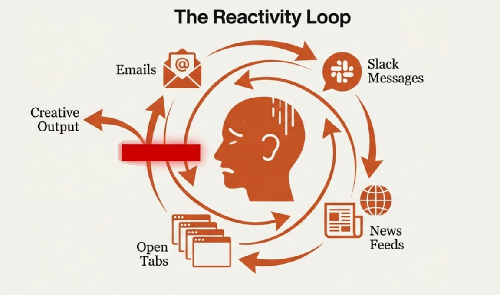
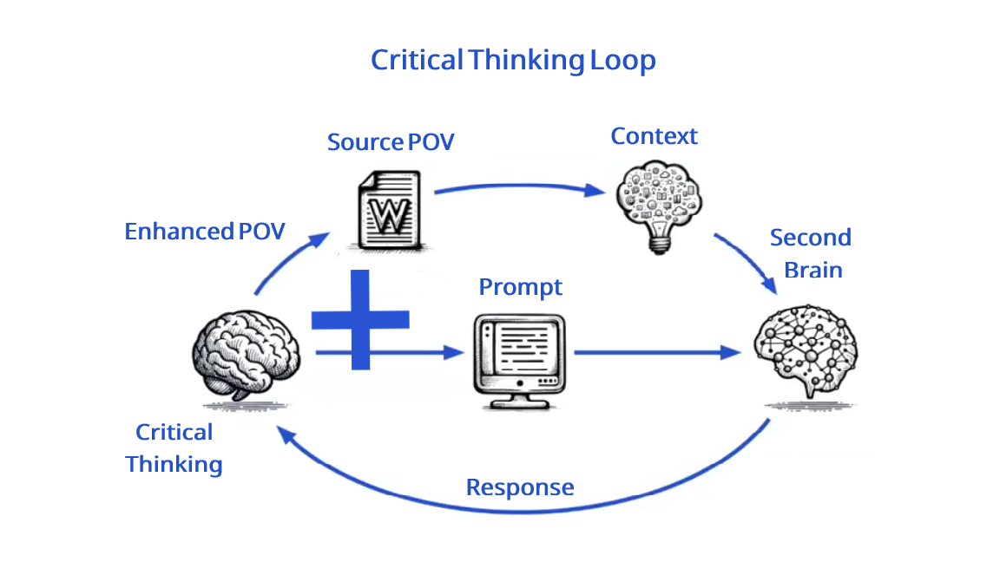
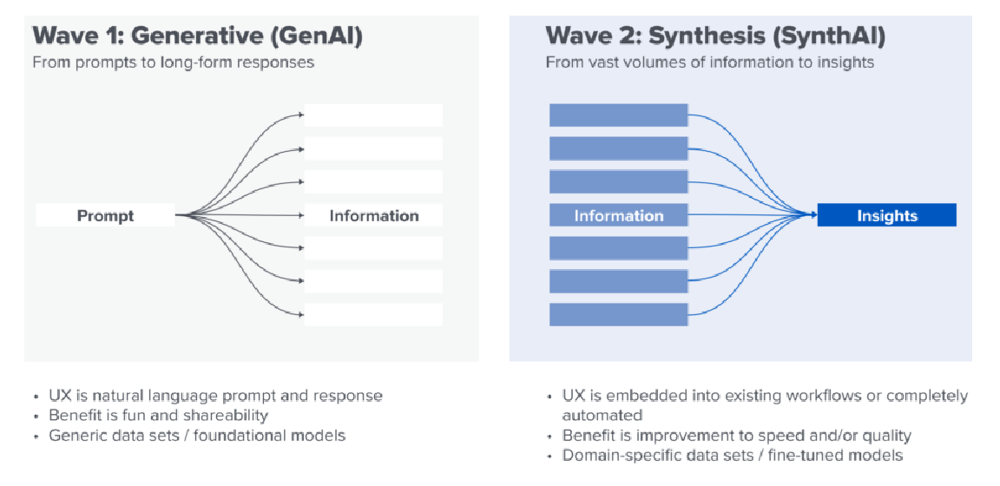

# A Second Brain for Personal Knowledge Management

To avoid the Negative "Reactivity Loop" to Information Overload.

We need a Positive "Critical Thinking Loop" on a Second Brain.

Using Google Tools (Keep, Books, Drive, Docs, Gemini, Illuminate) & NotebookLM as a SynthAI Engine.

Extracting entities & context to build the Semantic Layer on a Knowledge Graph on Neo4j Database.

Answers to Possible Questions:
* Friction is a Feature
* Content is a bi-product
* Worflows are the Products
* Context Graph is the Asset
* Semantics are the Keys
* Trust is the Currency

Next Step: To make a Collaborative Knowledge Management System.

